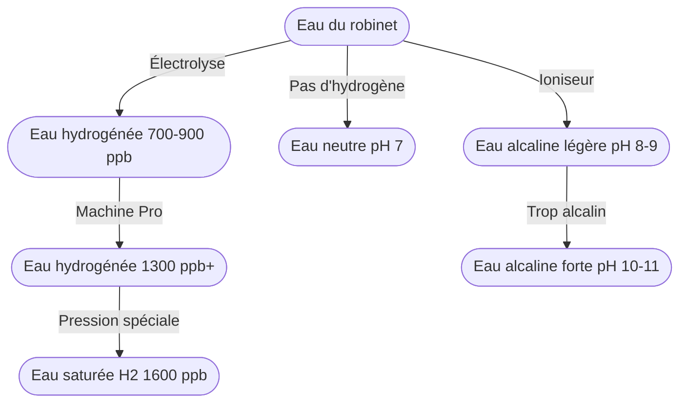

```
Alkaline water vs Eau hydrogéné chatgpt Hydrogene concentration ppb 

Est-ce que entre 700 & 900 ppb donne la définition du ppb? 

Cmt ça fonctionne? 

Et c’est l’eau qui est considéré comme eau alkaline certains atteignent plus de 1300 ppb 
pros and cons 
effets forces sur la santé mentale cerveau et santé physique forces augmente énergie performance 

Réduit inflammation 

Et douleur  live puissant anti-oxydant augmente clarté mentale cognitive fonction clarté récupération boost santé mentale 
```

Super sujet, très à la mode ! Voici une synthèse claire et détaillée sur la différence entre **eau hydrogénée** (hydrogen water) et **eau alcaline** (alkaline water), avec le rôle de la concentration en hydrogène (en ppb), la définition, le fonctionnement, et les effets potentiels sur la santé physique et mentale. On termine par un tableau des points forts/faibles, et un focus “effets cerveau/mental”.

**En résumé :**

- **Eau hydrogénée à 700-900 ppb** : bon compromis, antioxydant, boost cognitif possible, récupération optimisée.
- **Plus de 1300 ppb** : effet max mais attention au marketing et au prix.
- **Eau alcaline seule** : intérêt limité si objectif = santé mentale/antioxydant.

Si tu veux un schéma ou un guide pour choisir une machine ou savoir comment mesurer le ppb, fais-moi signe !

------

## 1. **Définitions**

### Eau hydrogénée (hydrogen water)

- **Définition** : Eau dans laquelle on a dissous de l’hydrogène moléculaire (H₂) gazeux.
- **Concentration mesurée en ppb** :
  - **ppb = "parts per billion"** (parties par milliard), donc 1 ppb = 1 µg (microgramme) d’hydrogène par litre d’eau.
  - Exemple : 900 ppb = 0,9 mg/L d’H₂ dissous.
- **Généralement obtenue** via électrolyse ou infusion directe de gaz H₂.

### Eau alcaline (alkaline water)

- **Définition** : Eau dont le **pH est supérieur à 7**, typiquement entre 8 et 10.
- **Obtenue** soit par électrolyse (ioniseurs d’eau), soit par ajout de minéraux alcalinisants (calcium, magnésium, potassium).


Super idée ! Voici **une représentation visuelle simplifiée** (en pseudo-Mermaid, vu que les barres de couleur sont plus visuelles que le Mermaid pur texte, je te propose les deux formats) pour bien situer où se placent l’eau hydrogénée et l’eau alcaline **sur une échelle de concentration H₂ (ppb)** et **de pH**.

### 🧪 **Définition de "ppb"**

**ppb** signifie **"part per billion"**, en français : **"partie par milliard"**.
 C’est une **unité de concentration** utilisée pour mesurer la quantité extrêmement faible d'une substance dans une autre (généralement un gaz ou un liquide).

- **1 ppb = 1 unité de substance pour 1 000 000 000 (un milliard) d’unités de base.**
- En notation scientifique :
   **1 ppb = 1 × 10⁻⁹ (soit 0,000000001)**

------

### 💧 **Application dans l’eau hydrogénée**

Dans le cas de l’**eau hydrogénée**, le ppb mesure la **concentration de gaz hydrogène (H₂) dissous** dans l’eau.

#### Exemple concret :

- **500 ppb d’H₂** signifie :
   Il y a **500 nanogrammes (ng)** de gaz hydrogène **par gramme (ou millilitre)** d’eau.
   (car 1 mL d’eau ≈ 1 g)
- En milligrammes par litre :
   **1 000 ppb = 1 ppm = 1 mg/L**

Donc :

- **700 ppb = 0,7 mg/L** de H₂
- **1 600 ppb = 1,6 mg/L**, qui est la **limite de saturation** naturelle du gaz H₂ dans l’eau à pression atmosphérique normale à 25°C.

------

### ⚙️ **Fonctionnement de la mesure**

- Les appareils (ex : testeurs à électrode platine, chromatographes gazeux) mesurent la **quantité de H₂ dissous** dans l’eau en ppb.
- On utilise des méthodes comme :
  - **Électrolyse** (libération d’H₂ par séparation de l’eau H₂O)
  - **Injection directe** de H₂ sous pression
  - **Méthodes chimiques** pour l’analyse

------

### 📏 Pourquoi ppb est utile ?

Parce que les effets du **gaz hydrogène moléculaire** sur la santé (antioxydant, anti-inflammatoire, etc.) sont observés **à des doses très faibles**.
 Des études montrent que **seulement 0,5 à 1,6 mg/L (soit 500 à 1 600 ppb)** suffisent pour avoir des effets biologiques mesurables (source : Molecular Hydrogen Institute, 2021).

------

## 1. **Échelle de concentration H₂ dissous (en ppb)**

- **Zone "active"** pour bénéfices santé : **700 à 1300 ppb**
- **Au-delà de 1600 ppb** : l’eau ne dissout plus plus d’hydrogène à pression atmosphérique standard.

```
|-------------------|---------------------|-------------------------|
0 ppb            700 ppb              1300 ppb                1600 ppb (max)
 Eau du robinet  Taux conseillé     Haut de gamme         Saturation possible
                 (antioxydant)      (pro)                (limite solubilité)
```

------

## 2. **Échelle de pH (eau alcaline)**

- **Eau alcaline** : pH **8 à 9,5** conseillé
- **> 10** : Pas conseillé pour un usage régulier

```
|----|----|----|----|----|----|----|----|----|----|----|
 6   7    8    9   10   11   12
Acide  Neutre   Alcalin léger    Alcalin fort
(Eau   (eau     (eau             (pas conseillé
courante)      minérale)        pour la santé)
```

------

## 3. **Schéma Mermaid (texte) — Visualisation croisée**



------

## 4. **Barres colorées (pour un doc ou Canva) – À copier en graphique**

**Barre H₂ (ppb) :**

```
[0]———————[700]————[900]——————[1300]——————[1600]
 Eau robinet    |     Zone optimale     |  Haut de gamme    |  Saturation
```

**Barre pH :**

```
[6]———[7]——[8]——[9]——[10]——[11]
 Acide  Neutre  Alcalin léger   Trop alcalin
         ↑               ↑
    Eau robinet      Eau alcaline
```

------

## 5. **Où situer chaque type d’eau ?**

- **Eau du robinet** : pH 6,5 à 7,5 / H₂ ≈ 0 ppb
- **Eau alcaline classique** : pH 8 à 9,5 / H₂ ≈ 0 ppb (sauf électrolyse)
- **Eau hydrogénée** : H₂ 700-900 ppb (parfois +) / pH variable selon méthode

------

## **Résumé visuel rapide**

| Eau            | pH        | H₂ dissous (ppb) |
| -------------- | --------- | ---------------- |
| Eau du robinet | 6,5 – 7,5 | ≈ 0              |
| Eau alcaline   | 8 – 9,5   | ≈ 0              |
| Eau hydrogénée | 7 – 9,5   | 700 – 1600       |

------

## 2. **Hydrogène dissous – seuils et fonctionnement**

- **700 à 900 ppb** :
  - Niveau courant dans les machines domestiques haut de gamme.
  - Beaucoup d’études utilisent ce niveau pour observer des effets physiologiques.
- **Plus de 1300 ppb** :
  - Certains dispositifs avancés atteignent 1300-1600 ppb.
  - Plus la concentration est élevée, plus le potentiel antioxydant est important (dans la limite de solubilité ~1,6 mg/L à 1 atm).

#### **Comment ça fonctionne ?**

- L’hydrogène moléculaire (H₂) dissous **agit comme un antioxydant sélectif** :
  - Neutralise spécifiquement les radicaux libres toxiques (ex. hydroxyles, peroxynitrite).
  - L’hydrogène H₂ pénètre rapidement dans les cellules et organes, y compris le cerveau.

------

## 3. **Eau hydrogénée = eau alcaline ?**

- **Non** :
  - Beaucoup de machines qui produisent de l’eau alcaline produisent aussi de l’eau hydrogénée (électrolyse), mais **ce sont deux paramètres différents**.
  - **Une eau peut être hydrogénée sans être très alcaline**, et inversement.
- **Vérifier** :
  - **pH** (pour alcalinité) et **concentration H₂** (pour hydrogène) sont mesurés séparément.

------

## 4. **Effets santé physique et mentale** (selon les études – à nuancer !)

### **Avantages prônés (surtout pour l’eau hydrogénée) :**

| Effet                            | Description                                                  | Preuves (études humaines)              |
| -------------------------------- | ------------------------------------------------------------ | -------------------------------------- |
| **Antioxydant puissant**         | Neutralise les radicaux libres les plus toxiques             | Études préliminaires, surtout in vitro |
| **Réduit inflammation**          | Amélioration chez sportifs, réduction marqueurs inflammatoires | Quelques études cliniques/sur sportifs |
| **Diminue douleurs**             | Ex. douleurs musculaires après exercice                      | Observé chez sportifs                  |
| **Augmente énergie/performance** | Moins de fatigue, meilleure récupération                     | Plusieurs études sportives (limitée)   |
| **Améliore récupération**        | Récupération musculaire, meilleure gestion du stress oxydatif | Études petites échelles                |
| **Effets sur cerveau/mental**    | Amélioration clarté mentale, fonction cognitive, humeur      | Études préliminaires, témoignages      |
| **Santé métabolique**            | Baisse sucre sanguin, amélioration profils lipidiques        | Petites études sur diabète/obésité     |
| **Hydratation supérieure**       | Pénétration cellulaire améliorée                             | Études limitées                        |

### **Pour l’eau alcaline seule** :

- **Effet principal :** Peut réduire acidité gastrique, améliorer reflux chez certaines personnes, améliorer hydratation selon certains.
- **Pas d’effet antioxydant direct** (sauf si combinée à l’hydrogène).

------

## 5. **Inconvénients et limites**

| Limite / inconvénient         | Description                                                  |
| ----------------------------- | ------------------------------------------------------------ |
| **Effets non garantis**       | Beaucoup d’effets reposent sur études préliminaires ou petites cohortes |
| **Durée d’action**            | H₂ s’évapore vite – boire immédiatement après production     |
| **Prix des machines**         | Bon générateur = cher (> 600 € souvent)                      |
| **Aucun effet miracle**       | Ne remplace ni une alimentation saine ni un traitement médical |
| **Eau alcaline trop basique** | Peut perturber l’équilibre digestif si excès                 |
| **Effets santé mentale**      | Amélioration de la clarté mentale rapportée, mais non universelle |

------

## 6. **Résumé des effets "cerveau/santé mentale" (hydrogène surtout)**

- **Augmentation de la clarté mentale**
- **Réduction du stress oxydatif cérébral**
- **Potentiel effet anti-inflammatoire dans le cerveau**
- **Soutien à la récupération cognitive après effort ou fatigue**
- **Peut améliorer l’humeur, réduire fatigue mentale**
- **Pas d’effet psychoactif, mais sensation de "légèreté" ou de "boost" rapportée chez certains**

------

## 7. **Comparatif rapide**

| Critère              | Eau hydrogénée                         | Eau alcaline                   |
| -------------------- | -------------------------------------- | ------------------------------ |
| **Antioxydant ?**    | Oui (H₂)                               | Non (sauf si hydrogène ajouté) |
| **pH élevé ?**       | Pas forcément                          | Oui (>7)                       |
| **Effets cerveau ?** | Oui, potentiels (études préliminaires) | Non prouvés                    |
| **Hydratation**      | Optimisée (effet rapporté)             | Bonne                          |
| **Prix machine**     | Variable (générateurs H₂ chers)        | Ioniseur alcalin = cher        |

------

## 8. **En pratique**

- **Pour bénéficier d’un effet antioxydant et sur la clarté mentale**, privilégier **eau hydrogénée avec un taux de 700-900 ppb minimum** (à boire dans les 20 min !).
- **Pour l’effet alcalinisant digestif**, l’eau alcaline seule peut suffire, mais l’effet santé globale reste limité sans hydrogène dissous.

------

## **Sources**

- https://www.ncbi.nlm.nih.gov/pmc/articles/PMC5731988/
- https://www.hydrogenstudies.com/

------

